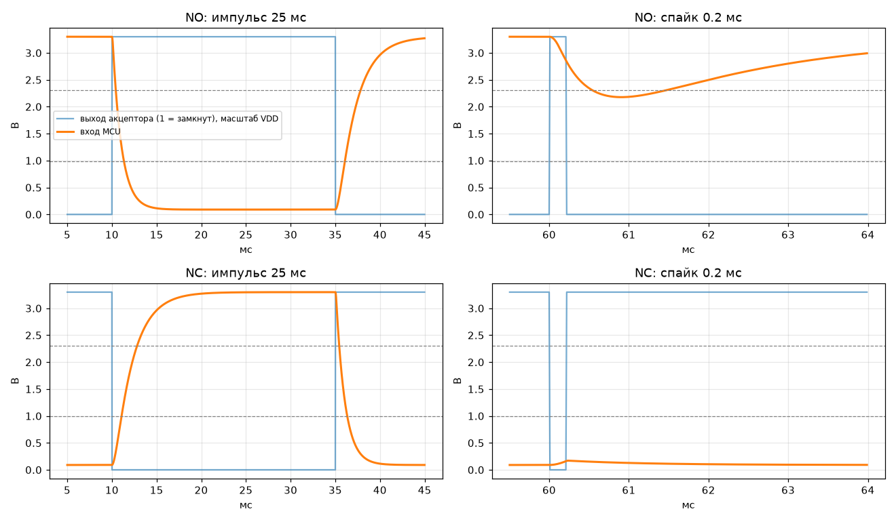
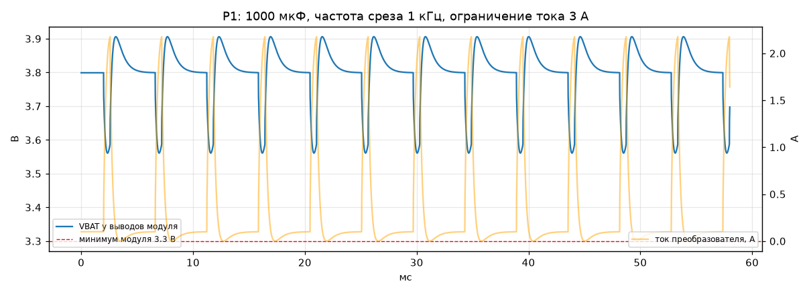
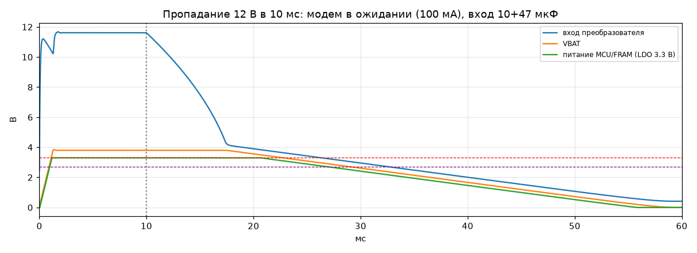

# ИМ-01, шаг 1 — аналоговая симуляция: результаты и поправки к спецификации

Дата: 15.09.2026. Симулятор: ngspice 42. Как повторить: `python3 sim/run_sim.py` —
пересобирает все цифры в [`sim/results_auto.md`](../sim/results_auto.md) и графики в `sim/out/`.

## Коротко, без схемотехники

Схема в целом рабочая: импульсы проходят чисто, помехи отсекаются, 1000 мкФ на питании модема
в большинстве случаев хватает. Нашлись четыре вещи, которые надо поправить до разводки платы:

1. **Преобразователь питания выбран не того класса.** Спецификация обещает вход 9–30 В, а MP1584
   по даташиту работает только до 28 В. При горячем подключении 30 В на его входе бывает 41 В.
   Нужен преобразователь на 60 В (класс LMR16020). Это дороже на десятки рублей, лимит 1709 ₽
   не под угрозой.
2. **Одна ошибка монтажа может сломать работу аппарата.** Если на разъёме устройства перепутать
   «+12 В» и «землю», наш вход просаживает линию импульсов аппарата с 12 до 2.6 В — аппарат может
   принять это за бесконечный импульс. Решение 2 из §3 («не может нарушить работу аппарата») это
   нарушает. Лечится ещё одним диодом за 1 ₽.
3. **Запас питания при отключении света меньше обещанного.** Когда модем простаивает, после
   пропадания 12 В устройство живёт 17 мс. Во время передачи — только 3.3 мс, впритык ко времени,
   за которое импульс проходит фильтр. Нужны датчик пропадания 12 В и ключ, отключающий модем
   (он же пригодится для аварийной перезагрузки модема) — тогда запас больше 70 мс.
4. **Порог 10 мс в прошивке стоит на краю.** Фильтр входа растягивает или сжимает импульс на
   0.8–1.5 мс, поэтому помеха в 9 мс может пройти как 10 мс. Предлагаю порог 15 мс — это всё ещё
   намного меньше самого короткого настоящего импульса (25 мс).

Пункты 1–3 — инженерные решения внутри §4–§5, пункт 4 меняет требование §7, по нему нужно ваше
согласие.

## Критерии приёмки шага 1 (IM-01 §9)

| Критерий | Итог |
| --- | --- |
| Задержка фильтра < 3 мс, оба режима NO/NC | проходит: 2.82 мс при номинале §4, **2.19 мс с подтяжкой 4.7 кОм** |
| Спайк 0.2 мс не доходит до логического порога, NO и NC | проходит во всех вариантах, включая деградацию оптопары до CTR 20 % |
| VBAT не опускается ниже минимума модуля (3.3 В по Hardware Design Manual Air780E) | проходит при 1000 мкФ во всех профилях нагрузки, если частота среза петли ≥ 1 кГц; на 0.5 кГц — 3.34 В, запас 40 мВ |
| Ни один элемент не выходит за предельные режимы | **проходит только с поправками ниже**: преобразователь на 60 В, диод Шоттки на 60 В, резистор светодиода 1206 |

## 1. Входной каскад (§4)

Модель: открытый коллектор акцептора, штатная подтяжка контроллера аппарата 10 кОм к 12 В,
оптопара PC817-класса, фильтр 10 кОм + 100 нФ, пороги входа MCU худшего случая STM32
(низкий ≤ 0.3·VDD, высокий ≥ 0.7·VDD).

| Подтяжка / CTR | Задержка, худший фронт | Спайк 0.2 мс: NO / NC | Искажение длительности импульса |
| --- | --- | --- | --- |
| 10 кОм / 50 % (номинал §4) | 2.82 мс | 2.18 В / 0.17 В | NO +1.5 мс, NC −1.5 мс |
| 10 кОм / 20 % | 2.81 мс | 2.60 В / 0.21 В | ±1.35 мс |
| **4.7 кОм / 50 %** | **2.19 мс** | 2.31 В / 0.23 В | **±0.8 мс** |
| 4.7 кОм / 20 % | 2.17 мс | 2.89 В / 0.32 В | ±0.5 мс |
| 10 кОм / 50 %, VDD 1.8 В | 2.78 мс | 1.18 В / 0.12 В | ±1.45 мс |

Нагрузка на линию акцептора: 4.9 мА через светодиод, вместе со штатной подтяжкой 6.1 мА —
десятки миллиампер открытого коллектора с запасом. В режиме NC светодиод горит постоянно.

Что видно на графике: после спайка вход MCU продолжает проседать ещё около 0.2 мс — это время
рассасывания заряда в насыщенном фототранзисторе. Чем выше CTR, тем глубже насыщение и тем
заметнее эффект. Реальную величину даст осциллограф на пилоте.

**Поправки:**

- **Подтяжка выхода оптопары — 4.7 кОм вместо 10 кОм.** Задержка падает с 2.82 до 2.19 мс
  (запас до 3 мс вырастает вдвое), искажение длительности — с ±1.5 до ±0.8 мс, фототранзистор
  меньше насыщается. Ток через подтяжку 0.7 мА, даже при CTR 20 % оптопара открывается полностью.
- **Последовательный диод в цепи светодиода** (LL4148/1N4148) в дополнение к обратному
  параллельному. Параллельный остаётся обязательным, как в §4: он держит обратное напряжение на
  светодиоде около 0.6 В. Последовательный нужен против ошибки монтажа C1 ниже. Ток светодиода
  падает с 4.93 до 4.63 мА — несущественно.
- **Резистор 2.2 кОм — типоразмер 1206** (0.25 Вт): на 12 В рассеивается 53 мВт, 21 % номинала.
  На линии 24 В было бы 235 мВт — 94 % номинала 1206; если такие аппараты встретятся, ставить два
  1206 по 1.1 кОм последовательно.

### Ошибки монтажа

| Случай | Что происходит |
| --- | --- |
| Перепутаны «+12 В» и «импульс», параллельный диод есть | светодиод под 0.66 В обратного — цел; линия аппарата не нагружена; импульсы не видны, LED1 не мигает — ошибка обнаруживается на монтаже |
| То же без параллельного диода | 12.6 В обратного при пределе PC817 6 В — светодиод погибает. Требование §4 подтверждено |
| C1: перепутаны «+12 В» и GND, только параллельный диод | **линия импульсов аппарата в покое проседает с 12 до 2.64 В** — ток течёт от штатной подтяжки аппарата через обратный диод |
| C2: то же, с последовательным диодом | линия 12.0 В, светодиод цел |

Разъёмы ключёванные (§6), поэтому C1 возможна только при самодельном или неправильно обжатом жгуте,
но диод за 1 ₽ дешевле любого разбирательства с «глючащим» аппаратом.

## 2. Защита входа питания (§5)

Цепочка: кабель 1.5 мкГн → предохранитель → диод Шоттки от переполюсовки → TVS → входные
конденсаторы 10 мкФ керамика + 47 мкФ электролит → преобразователь.

**Противоречие в спецификации.** §5 требует вход 9–30 В и называет MP1584-класс, а у MP1584 рабочий
диапазон 4.5–28 В. Даже без переходных процессов 30 В за пределами его паспорта, а TVS со стоянием
≥ 30 В ограничивает уже на 37–53 В.

| Сценарий | Вариант A: 9–30 В, SMBJ33A, преобразователь на 60 В | Вариант B: только 12 В, SMBJ18A, MP1584 (до 28 В) |
| --- | --- | --- |
| Горячее подключение 12 В | 11.5 В | 11.5 В |
| Горячее подключение 12 В, плавкий предохранитель, без электролита | — | 16.2 В |
| Горячее подключение 30 В | 29.5 В | не применимо |
| Горячее подключение 30 В, плавкий предохранитель, без электролита | **41.2 В**, TVS принял 2.9 А | не применимо |
| Выброс +50 В / 2 Ом / 50 мкс поверх 12 В | 19.1 В — поглотили входные конденсаторы | 19.1 В |
| Стресс +100 В / 10 Ом / 1 мс | 41.4 В, в TVS 46 мДж | 23.5 В, в TVS 73 мДж |
| Постоянные 24 В | 23.7 В, норма | **TVS проводит 2.5 А постоянно — сгорит** |
| Переполюсовка −30 В | на Шоттки **43 В обратного** (звон кабеля) | то же |

**Поправки:**

- **Вариант A.** Широкий вход в §5 выбран намеренно («откуда брать питание, решается на
  монтаже»), значит, менять надо микросхему, а не диапазон: **преобразователь класса 60 В, 2 А**
  (например, TI LMR16020: вход 4.3–60 В, 2 А), **TVS SMBJ33A**. Строка сметы «Преобразователь 2 А +
  защита + 1000 мкФ» подорожает на десятки рублей — цену нужно запросить у поставщика.
- **Диод Шоттки — на 60 В (SS36-класс), не на 40 В.** При переполюсовке −30 В звон кабеля даёт на
  нём 43 В.
- **Электролит на входе обязателен** (47 мкФ / 50 В, ESR ~0.4 Ом): он гасит звон при горячем
  подключении. Без него и с обычным плавким предохранителем пик достигает 41 В.
- Самовосстанавливающийся предохранитель (0.15–1 Ом) дополнительно демпфирует звон — лучше
  плавкого.

Вариант B допустим, только если отказаться от 24 В и отдельного отвода питания.

## 3. Просадка VBAT (§5.2)

Модель — усреднённый преобразователь с токовым управлением. Настоящей компенсации будущей
микросхемы модель не знает, поэтому частота среза петли перебрана от 0.5 до 40 кГц. Важная
деталь: у LMR16020 компенсация **внутренняя**, под 1000 мкФ её не перенастроить, частота среза
падает примерно обратно пропорционально ёмкости выхода. Поэтому реалистичны как раз столбцы
0.5–1 кГц.

Минимум VBAT у выводов модуля, В (ограничение тока 3 А):

| Ёмкость (ESR) | Профиль | 0.5 кГц | 1 кГц | 5 кГц | 15 кГц |
| --- | --- | --- | --- | --- | --- |
| 470 мкФ (40 мОм) | P1: пики 2 А по 577 мкс | 2.87 ✘ | 3.32 | 3.68 | 3.73 |
| 1000 мкФ (25 мОм) | P1 | **3.34** | 3.56 | 3.73 | 3.75 |
| 2200 мкФ (18 мОм) | P1 | 3.58 | 3.68 | 3.75 | 3.76 |
| 1000 мкФ | P2: LTE-подобный, до 1.1 А | 3.58 | 3.69 | 3.77 | 3.78 |
| 1000 мкФ | P3: 2 А непрерывно 20 мс | **3.34** (выброс 4.24) | 3.56 | 3.73 | 3.75 |

Полные таблицы — в `sim/results_auto.md`.

**Выводы:**

- **1000 мкФ достаточно, но впритык при медленной петле.** Оценка 5800 мкФ из §5.2 была слишком
  пессимистичной: она предполагала, что петля не реагирует всю пачку, и допуск 0.2 В, тогда как
  реальный допуск от 3.8 до 3.3 В — 0.5 В.
- Профиль P1 (GSM-подобные пачки) — с запасом хуже реального для Cat.1. Для более реалистичного P2
  при 1000 мкФ минимум 3.58 В даже на 0.5 кГц.
- **Поправка:** 1000 мкФ оставить базовым значением, но: (а) у выбранного преобразователя проверить
  по даташиту, допускает ли он такую выходную ёмкость при внутренней компенсации (устойчивость и
  запуск); (б) если реальная частота среза с этой ёмкостью окажется ниже 1 кГц — брать 1500–2200 мкФ;
  (в) на пилоте снять осциллографом просадку при реальной передаче.
- Выброс при сбросе нагрузки на медленной петле доходит до 4.24 В при пределе модуля 4.3 В —
  проверить там же.

## 4. Удержание питания при пропадании 12 В (§2)

§2 утверждает, что ёмкость даёт «десятки миллисекунд», чтобы записать последний импульс.

| Нагрузка | До просадки модема < 3.3 В | До отказа MCU/FRAM (< 2.7 В) |
| --- | --- | --- |
| Модем в ожидании, 100 мА | 12.7 мс | 17.0 мс |
| Модем передаёт, 500 мА | 2.5 мс | **3.3 мс** |
| Передаёт, но модем отключается ключом при входе < 9 В | > 70 мс | > 70 мс |
| Передаёт, вход +100 мкФ | 5.0 мс | 6.0 мс |

Импульс проходит входной фильтр за 2.2–2.8 мс; во время передачи на запись в FRAM остаётся меньше
миллисекунды. Утверждение §2 верно только при простаивающем модеме.

**Поправки:**

- **Датчик пропадания 12 В**: делитель на вход компаратора или АЦП MCU, прерывание при входе
  ниже ~9 В. Около 2 ₽.
- **Ключ питания модема** (P-MOSFET, Rds ≤ 30 мОм — он стоит в цепи бросков 2 А): по прерыванию
  пропадания питания прошивка отключает модем, остаётся ~10 мА на MCU, запас > 70 мс. Тот же ключ
  даёт аппаратный сброс модема для watchdog из §7 п. 5 — сбросить зависший модем по питанию
  надёжнее, чем командой. Около 5–8 ₽.

## 5. Что это меняет в прошивке (§7) — вход для шага 3

- **Считать на заднем фронте, после проверки длительности.** В режиме NC пропадание 12 В гасит
  светодиод, и для MCU это выглядит как начало импульса, который никогда не закончится. Счёт по
  заднему фронту с проверкой длительности такой «импульс» не засчитает.
- **Как совместить «аппаратный счётчик» и «фильтр ≥ 10 мс».** Счётчик таймера в режиме внешнего
  тактирования считает каждый фронт и длительность не проверяет, а цифровой фильтр входа таймера
  работает в микросекундах, а не в миллисекундах. Предложение для шага 3: таймер в режиме захвата
  фронтов с DMA в кольцевой буфер — момент каждого фронта записывается аппаратно, без участия ядра
  (гарантия §2 сохраняется), а прошивка позже разбирает пары фронтов и делит импульсы на принятые
  и отбракованные. Второй таймер как голый счётчик фронтов остаётся контрольной суммой.
- **Порог длительности: 15 мс вместо 10 мс (нужно согласие).** Фильтр искажает длительность на
  ±0.8 мс (подтяжка 4.7 кОм) или ±1.5 мс (10 кОм), знак зависит от режима NO/NC. С порогом 10 мс
  помеха в 9 мс может пройти. Самый короткий настоящий импульс у всех трёх акцепторов — 25 мс,
  после фильтра не короче 24.2 мс, так что 15 мс оставляет запас в обе стороны.

## 6. Часы передачи (§3, решение 7)

Уточнение владельца от 15.09: аппараты включены круглосуточно, покупатели бывают с 8 до 22.
Сбоя счёта передача не вызывает (счёт аппаратный), но окна логично поставить на простой:

- **22:30** — снимок сразу после закрытия, в нём весь день целиком;
- **07:30** — повтор перед открытием, если вечером не удалось;
- каждому устройству — случайный сдвиг 0–10 минут, чтобы 500 модемов не выходили в сеть в одну
  секунду.

Решение 7 требует совпадения с расписанием iVend (DECISION-032: 07:00 и 19:00). В 19:00
покупатели ещё идут, и дневной безнал нельзя будет сравнить с импульсами на одной отсечке. Если
сверять день ко дню, синхронизацию iVend тоже стоит перенести на 22:30 / 07:30. Это изменение
решения из §3 — только с согласия владельца.

## 7. Чего симуляция не показывает — остаётся на пилот (§10)

- реальную длительность, полярность и шум импульсов у TB74, VN-5, EU-9 рядом с соленоидом;
- реальное время выключения PC817 при подтяжке 4.7 кОм;
- реальный профиль тока модема и частоту среза выбранного преобразователя с 1000 мкФ;
- собственный запас питания акцептора: если акцептор успевает выдать импульс после того, как
  отключилось наше устройство, этот импульс пропадёт — это решается датчиком пропадания 12 В и
  сверкой с ручными показаниями.

## Источники цифр из даташитов

- MP1584, вход 4.5–28 В: [MPS, MP1584 Rev. 1.0](https://www.mouser.com/datasheet/2/277/MP1584_r1.0-779241.pdf)
- Air780E, VBAT 3.3–4.3 В, источник питания не менее 1 А: [Air780E Hardware Design Manual](https://fcc.report/FCC-ID/2AEGG-AIR780E/7368233.pdf)
- LMR16020, вход 4.3–60 В, 2 А, внутренняя компенсация: [TI LMR16020](https://www.ti.com/product/LMR16020)
- PC817: обратное напряжение светодиода 6 В — по IM-01 §4.
